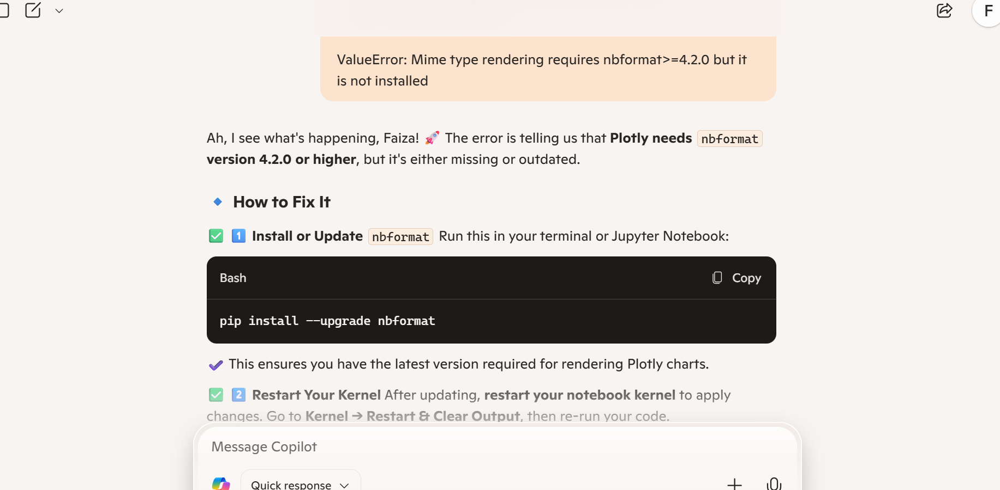

# Hackathon : Healthcare Insurance Cost Analysis - Project 1

# 

**Hackathon - Python ETL & Visualisation ** This project is designed to sharpen and show the steps to how ETL and visualisation works hand in hand. This is an opportunity to use data, project management and presenatation skills using this project.

## Dataset Content
* This dataset is about healthcare insurance and contains records including demographic and lifestyle factors that impact the costs of insurance. The dataset contains information on the relationship between personal attributes like: age, gender, BMI, family size, smoking habits, geoographic factors and their impact on medical insurance charges. This dataset helps anaylse fctors affecting healthcare costs and usuaeful for predictive modelling in the insurance industry. it also allows data visualisation to understand expense trends across different groups. The current size of the dataset is at 0.99GB.

## Business Requirements
* Understanding cost Drivers - Identifying key factors that are affecting healthcare insurance costs (Age, BMI, smoking status, Region, etc)

* Provide Actionable Insights - This enables insurance companies or individuals to have a better understanding on how lifestyle choices impact pricing.

* Improves Predictive Modelling - This can be used for more advanced data science techniques to develop models for estimating the future of insurance costs.

* Visualise Trends - This helps visualise trends effectively to generate clear charts and dashboards, highlighting cost patterns and correlations.

* ETL - Clean, transform and validate  the dataset to avoid misleading conclusions.

## Hypothesis and how to validate?

Hypotheses -
* Do I want to know age distributions or comparing insurance costs on smokers and non smokers?

* Smokers will have significantly higher insurance charges than non-smokers.

* BMI and insurance costs may be positively correlated (higher BMI → higher charges)

* Older individuals will generally have higher insurance costs compared to younger individuals.

* If children are counted in on this data, the number of children covered under a policy may influence total charges.

How to Validate These hypotheses? - 

 * calculate the average insurance charges for smokers vs non- smokers 

 * Compare 'mean' insurance costs across the age groups

 * deciding on the best visuals to represent the data; boxplots or bar charts?

 * Interactive scatter plot in BMI vs Charges to check correlation strengths.

## Project Plan
I will break my project plan down into three sections:

**Steps Taken -** 
The best way to manage myself for this project was to take a step back and manage my expectations. I decided to spend most of Day 1, planning and sorting out the foundations of this project to make sure the basis was layed out. 

I started with arranging my Kanban board to reflect my project management section of this project, I then clone a respo designed with all the correct requirements and features I needed to be able to run this project on the VS Code. With that being said, I then set up my Jupyter Notebooks, README file and ran any codes that was needed to then have the Kernel set-up.

After the setting up process, then came the file extraction, which I had got from Kaggle. For the dataset I went ahead and used the Healthcare Insurance Costs Analysis. Here I then implemented the ETL method: Extract, Transform, Load and Validate. 

Once the data has been cleaned and transformed I had then moved onto upkeeping my README and updating my Kanban board.

Moving onto the visualisation, I then created a 3 plots, one being a bar chart, a histogram and an interactive scatter plot.

After this, I had updated my README and Kanban board as expected and finalised everything with a presentable presentation. 

**How was the data managed throughout the collection, processing, analysis and interpretation steps?**

1. Data Collection
The dataset was sourced from [Kaggle] and contains healthcare insurance records with attributes like age, BMI, smoker status, and insurance charges. Initial inspection was performed using df.info() and df.describe() to understand its structure, completeness, and distribution.

2. Data Processing
Cleaning Steps Taken:

Missing values in categorical columns (smoker, region) were filled using mode.

Numerical columns with missing values were replaced using mean.

Duplicates were checked and removed where necessary.

Transformations Applied:

Categorical Encoding: Converted "smoker" (yes/no → 1/0) and "region" into numerical values using .cat.codes.

Standardized Format: The cleaned dataset was stored using df.to_csv("processed_data.csv", index=False).

3. Data Analysis
Summary statistics (df.describe()) helped identify trends in insurance charges. Correlation checks (df.corr()) measured relationships between variables like BMI, age, and charges. Key hypotheses were validated through visualization techniques (histograms, bar charts, scatter plots).

4. Data Interpretation
Insights Generated:

Smoking status significantly impacts insurance costs.

Age plays a role in pricing but has varied trends across different age groups.

BMI showed weak correlation with charges, suggesting other factors may be stronger cost predictors.

**Why did you choose the research methodologies you used?**

Lets start with descriptive statistics: I chose this to better understand metrics like averages, distribution and trends. 

In terms of visualisations, I used this to show the patterns in the insurance and how it corresponds with BMI and age. My angle was to start with a more general view as apposed to focusing just on the smoker and non - smokers as it seemed quite narrow and wouldnt show the general issue of the data.

Lastly, I didnt take the predictive route as healthcare seems to require more exploratory analysis rather than prediction due to the nature of uncertain health conditions. 

## The rationale to map the business requirements to the Data Visualisations
* Understanding Cost Drivers - Bar Chart (Age vs Charges). This helps shows how insurance costs changes with age. It helps companies use this structure with pricing. It was also an insight to show how pricing can also still be adjusted, especially as younger people cannot afford these extra costs early on.

* Identifying Patterns in Costs - Histogram (Charges Distrubtion). This simply gives a bigger picture view on how insurance prices vary, helping businesses see cost trends.

* Exploring Lifestyle Impact - Scatter Plot (BMI VS Charges). This shows if the BMI affects insurance pricing which in turn, helps clients make health related decisions.

## Analysis techniques used
* Descriptive Statistics - I used the df.describe() to summarise key metrics like 'mean', 'median' and distribution. This provided a broad overview but doesn't explain deeper relationships in the data. 
Alternative: Using correlation analysis (df.corr()) to measure how features impact insurance costs.

* Visualisation (Histograms, Bar Charts and Scatter Plots) - Was used to highlight trends in age, BMI and smoker-related costs. The limitation was some relationships (like BMI vs Charges) may have been weak, requiring additional analysis.
Alternative: Regression modeling could further quantify relationships.

* Data Limitations & Alternative Approaches - Potential limitations: The dataset may not have enough varitaions (e.g., if certain age groups are underrepresented).
Alternative: Normalise the data where necessary and focus on key feature comparisons to avoid misleading trends.

* Using Generative AI for Ideation & Optimisation - Ideation: AI helped brainstorm visualiz#sation approaches suited for business needs.
Design Thinking: AI suggested structured explanations for README documentation. 
Code Optimisation: AI guided efficient use of Pandas, Seaborn, and Plotly, ensuring cleaner, more scalable code.

## Ethical considerations
* Bias & Fairness: Potential bias may exist if certain demographic groups are over- or underrepresented. To mitigate this, a fairness check was conducted by analyzing distributions across age, region, and smoker status.

* Legal & Societal Issues: The dataset was used strictly for analytical purposes, with insights focused on general trends rather than individual predictions, ensuring ethical transparency.

* Data Privacy: The dataset does not contain personally identifiable information (PII), ensuring individual privacy is protected.

## Unfixed Bugs
* The sections on the Notebook has an error message that is more of a warning than that a necessary change needed. The error appeared on 2 of the grapths (Bar chart and Histogram) which I corrected one of them and left the other as I was ok with the colour theme it had. The prompt is attached here underneath the Histogram:

**C:\Users\faiza\AppData\Local\Temp\ipykernel_23852\231279000.py:2: FutureWarning:** 

**Passing `palette` without assigning `hue` is deprecated and will be removed in v0.14.0. Assign the `x` variable to `hue` and set `legend=False` for the same effect.**

  **sns.barplot(data=age_avg_charges, x='age_group', y='charges', palette='coolwarm')**

## Development Roadmap

**Challenges I faced:**
* I would say the challenges I faced was firstly around setting up my respo and the project entirely. I would say that the whole set wasn't hard, its just a lot to remember from the project management side, to the ETL side and the documentation. You have to have all the foundational elements otherwise it could set you back.

* There was also issues with setting up my Kernel, it seemed that i didnt finish installing the 'ipython' part to my code, even when I did install that to the terminal, it didnt work out, just to find out it was a simple 'turn off and turn on' rule.

* I would also say that my coding was also a key feature to remember as it has caused my Plotly to not show my interactive chart. This was all because I missed one code sequence to add on my terminal. You will see the screenshot below:

**What new skills or tools do you plan to learn next based on your project experience?**
* I would definitely say that having a separate notepad or a document that keeps all the codes in one place is the best move to make as it can be a guide to keep on top of the codes that I can use in my terminal. This keeps all the required codes in check whilst avoid any errors that may pop up later like 'source .venv/Scripts/activate' which was the reason my Plotly wasnt working due to having the set up done locally.

* In addition, I would also say that having a planner either through excel or any place to plan the setting up of a project works wonders! This has saved me a lot of time!

* Sometimes you just need to exit and reopen.

## Main Data Analysis Libraries
* Pandas - This used for loading, cleaning and transforming the dataset:

**import pandas as pd** 

**df = pd.read_csv("processed_data.csv")  # Load dataset**  
**df.info()  # Check structure**  
**df.describe()  # Get summary stats**  

* Numpy - This is used for effective numerical operations (like I did when convering the string information to integars):

**import numpy as np**  

**corr_matrix = np.round(df.corr(), 2)  # Generate correlation matrix**  
**print(corr_matrix)**

* Seaborn & Matplotlib - This is used for static visualisations ( which I did for Histograms and Bar charts):

**import seaborn as sns**  
**import matplotlib.pyplot as plt**  

**sns.histplot(df["charges"], bins=30)  # Histogram of insurance charges**  
**plt.title("Distribution of Insurance Costs")**  
**plt.show()**

* Plotly - This is used for interactive visualisation (like the scatter plot):

**import plotly.express as px**  

**fig = px.scatter(df, x="bmi", y="charges", color="smoker",** **title="BMI vs Insurance Charges")**  
**fig.show()**

## Credits 

*  (https://github.com/Code-Institute-Solutions/da-README-template/blob/main/README.md) - This README template was provided on GitHub by NielMc

* (https://github.com/Code-Institute-Org/data-analytics-template/tree/main) - The Data Analytics template that has all the features and requirement of this project by NielMc

*  - This article allowed me to have a more rounded view on what is happening in the world of insurance, using news and existing articles can help make better decisions on the best route to transform the data.

*  - This forum is insightful on coding as it helped me have a better understanding on different way on how I can code. 'cat.codes' helps me summaries statistics on a column of data which was handy when it came to transforming the data.

* Using AI chatbots like Micorsoft Copilot really help interpret information to me in a way that was understandable, especially when I came across errors in the system:

* Lastly, I wanted to have a better idea on the coding I wanted to use and wasnt too sure on where to start, I decided to start with looking back at my online classroom to give me a reminder on the sequence I can work with, I didnt use this entirely, but it gave me a good idea:

### Content 

- The text fonts where taken from (https://www.markdownguide.org/cheat-sheet/) 

### Media

- The photos above (the header of this README) is taken from the code institute website.

## Acknowledgements
* NeilMc - For the amazing templates and online classroom lessons (LMS).
* Emma Lamont - For starting and ending the day on a high note.
* John Rearden - For re-explaining simple code to us over and over again and being patient enough to do so.
* Mark Briscoe  - For being a great motivational speaker. 

